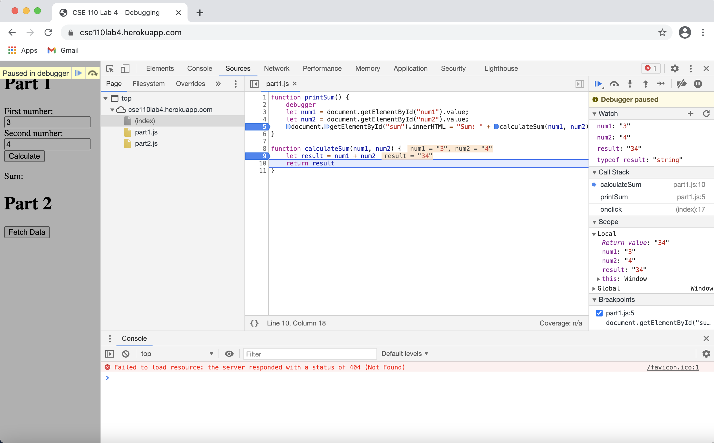
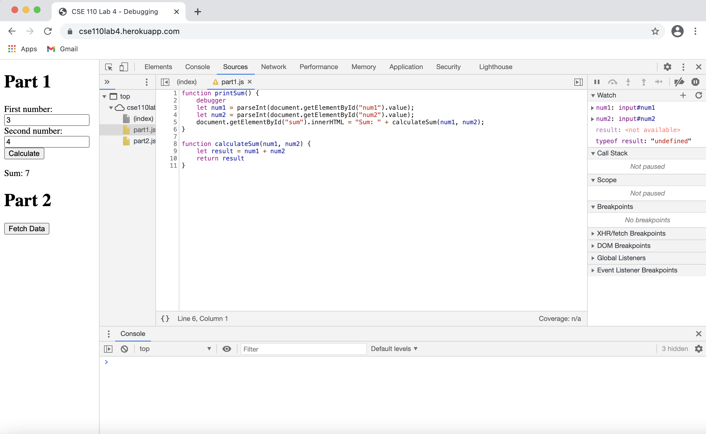

# Debugging

## Breakpoints

## Watch

## What was the bug?
The input from the user was not being converted into a number before summing them. So, the app was just concatenating the 2 inputs assuming them to be strings and returning a string.

## How would you fix it?
I will use parseInt() to convert string into integer. Then the app can correctly perform numeric addition and return the sum.

# Network Tab

1. citylots.json
2. part2.js
3. 11.7 MB
4. 2.32 s
5. Mozilla/5.0 (Macintosh; Intel Mac OS X 11_1_0) AppleWebKit/537.36 (KHTML, like Gecko) Chrome/88.0.4324.96 Safari/537.36
6. Apache
7. Tue, 26 Jan 2021 22:14:13 GMT
8. application/json
9. fetchData()